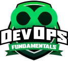

<table>
  <tr>
    <td>
      <h1>⚙️ Curso de DevOps Fundamentals - DIO</h1>
    </td>
    <td align="right">
      
    </td>
  </tr>
</table>

Repositório com os conteúdos, exercícios e projetos desenvolvidos durante o curso de **DevOps Fundamentals** oferecido pela [DIO.me (Digital Innovation One)](https://dio.me).

---

## 🧑‍🏫 Sobre o Curso

O curso fornece uma base sólida nos princípios do **DevOps**, abordando desde os fundamentos da computação em nuvem até práticas reais utilizando **Azure DevOps**. Durante as aulas, os alunos são guiados pela construção de pipelines, versionamento, automação de deploy e uso da infraestrutura como código.

---

## 📚 Conteúdo Abordado

### 🔹 Fundamentos de Cloud Computing e DevOps

- O que é Cloud Computing
- Benefícios da nuvem pública
- Integração entre Cloud, DevOps e times ágeis

### 🔹 Infraestrutura como Código (IaC)

- Conceitos de IaC
- Provisionamento de recursos via templates
- Vantagens da automação de infraestrutura

### 🔹 Conhecendo o Azure e Azure DevOps

- Visão geral da plataforma Azure Cloud
- Organização de times e projetos no Azure DevOps
- Boards, Repos, Pipelines e Artifacts

### 🔹 DevOps na Prática com Azure DevOps

- Criação de pipelines no Azure e GitLab
- Configuração de CI/CD com site estático
- Deploy em Azure Web App
- Versionamento com Git e GitLab

---

## 🚀 Projeto Prático Final

**Desafio:** Criar o repositório `dio-devops-desafio` no GitLab e configurar um pipeline CI/CD para publicar um site estático.

Este repositório inclui:

- 📂 `AulaDevops/`: Arquivos base fornecidos pelo curso para o desafio
- 📂 `dio-devops-desafio/`: Implementação prática com pipeline configurado

---

## ▶️ Como Executar

1. Clone o repositório:

```bash
git clone https://github.com/codeguima/devopsfundamentals.git


👨‍💻 Autor
Feito por [Jhonny Guimarães]
🔗 codeguima.com.br
💼 LinkedIn
